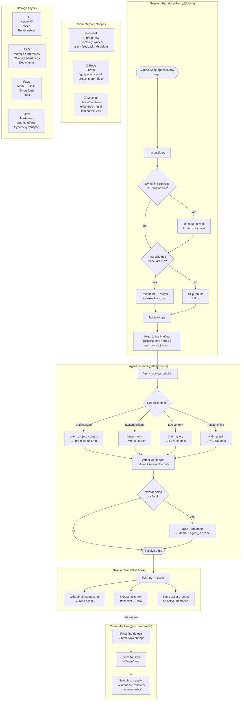

# memory-sync — Stateful Hedgehog Company Brain

Agent-accessible knowledge system built on KG + RAG + Mem0.  
Zero context pollution: agents query what they need, nothing is auto-injected.

---

## Brain Workflow



---

## For Human Engineers

### What this does

Every Claude Code session on any machine gets a 1-line briefing and access to a shared brain:

```
[BRAIN] Mac arm64 | gait_device | mcp__brain__query / graph / mem / remember / forget / ingest
```

Memories are stored in three scopes:

| Scope | Location | Synced? | Contains |
|-------|----------|---------|---------|
| Global | `~/.brain/raw/` | ✅ Syncthing | User profile, feedback, cross-project decisions |
| Repo | `<repo>/.brain/` | ❌ gitignored | Project state, last session, decisions |
| Machine | `<repo>/.brain/machine/` | ❌ gitignored | Tool paths, local env per project |

### Setup

**1. Install dependencies**
```bash
pip3 install mem0ai chromadb mcp anthropic ollama networkx \
             python-frontmatter pypdf pyyaml tiktoken --break-system-packages
```

**2. Pull local embedding model**
```bash
ollama pull nomic-embed-text
```

**3. Install the package**
```bash
pip3 install -e ~/memory-sync --break-system-packages
```

**4. Initialize brain storage**
```bash
cd ~/memory-sync && python3 -c "from brain.config import ensure_dirs; ensure_dirs(); from brain.kg import init; init(); print('ok')"
```

**5. Run machine probe** (writes capability profile)
```bash
python3 -m brain.probe_runner "$(hostname)" "$HOME"
```

**6. Wire Claude Code hooks** — add to `~/.claude/settings.json`:
```json
"UserPromptSubmit": [
  { "hooks": [
    { "type": "command", "command": "cd \"$HOME/memory-sync\" && python3 -m brain.reconcile --cwd \"$CWD\" --machine \"$(hostname)\" 2>/dev/null || true" },
    { "type": "command", "command": "cd \"$HOME/memory-sync\" && python3 -m brain.bootstrap --cwd \"$CWD\" --machine \"$(hostname)\" 2>/dev/null || true" }
  ]}
],
"Stop": [
  { "hooks": [
    { "type": "command", "command": "cd \"$HOME/memory-sync\" && python3 -m brain.flush --cwd \"$CWD\" --machine \"$(hostname)\" 2>/dev/null &", "async": true }
  ]}
]
```

**7. Register MCP server** — create `~/.claude/.mcp.json`:
```json
{
  "mcpServers": {
    "brain": {
      "type": "stdio",
      "command": "python3",
      "args": ["-m", "brain.mcp_server"],
      "cwd": "/path/to/memory-sync"
    }
  }
}
```

**8. Add to Syncthing**
Add `~/.brain/raw/` as a shared folder on all machines (Send & Receive).  
Do **not** sync `~/.brain/kg/`, `~/.brain/vector/`, or any `<repo>/.brain/`.

### Cross-machine sync flow

```
Mac session ends
  → flush.py writes new facts to ~/.brain/raw/
  → Syncthing detects changes → syncs to Linux
Linux session starts
  → reconcile.py sees new files → resolves conflicts (timestamp wins)
  → rebuilds KG + Mem0 indexes → injects updated briefing
```

Conflicts: Syncthing `.sync-conflict-*` files are auto-resolved by `reconcile.py` on the next session start. The newer file (by `updated:` frontmatter timestamp) wins; the loser is archived to `~/.brain/archive/` — never deleted.

### Storage layout

```
~/.brain/
  raw/         markdown source files — SOURCE OF TRUTH (Syncthing syncs this)
  archive/     forgotten memories (recoverable, never auto-deleted)
  kg/          NetworkX graph JSON — derived, local per machine
  vector/      ChromaDB embeddings — derived, local per machine
  mem0_history.db

<repo>/.brain/       gitignored
  context.md         last session state (updated by flush hook)
  docs/              ingested project documents
  machine/
    <hostname>.md    machine capabilities for this project
```

### Memory file schema

```yaml
---
name: short-kebab-slug
description: one-line hook used to decide relevance
metadata:
  type: user | feedback | project | reference | machine
  machines: [mac, linux, shared]
  updated: "2026-06-02T00:00:00Z"
  ttl: null            # or "30d", "90d" — null = never expires
  confidence: 1.0      # 0.0–1.0, decays while dormant
  status: active       # active | dormant | archived
  last_accessed: "2026-06-02T00:00:00Z"
  access_count: 0
---
```

### Forgetting

```
active (30d no access, access_count < 10) → dormant (out of indexes)
dormant (60d more) OR explicit forget     → archived → ~/.brain/archive/
```

- `type: feedback` + `access_count > 10` = permanently protected, never decays
- Explicit: `mcp__brain__forget(name)` cascades KG + Mem0 + archives raw file
- TTL: set `ttl: 30d` on session-state memories you know will go stale

### Ingesting documents from any repo

```bash
# From a Claude session:
mcp__brain__ingest(path="/path/to/repo/docs/", scope="repo", project="my-project")

# Or a single file:
mcp__brain__ingest(path="/path/to/datasheet.pdf", scope="global")
```

Documents are chunked (1000 tokens, 100 overlap), embedded locally via Ollama, and indexed in both the KG and Mem0 vector store. Retrieval returns chunks with source attribution — never the full document unless you call `mcp__brain__read_doc`.

### Troubleshooting

| Symptom | Fix |
|---------|-----|
| Hook not firing | Check `~/memory-sync` exists and dependencies installed |
| Mem0 auth error | Ensure `ANTHROPIC_API_KEY` is set (used for fact extraction) |
| Embedding error | Confirm `ollama serve` is running and `nomic-embed-text` is pulled |
| Slow reconcile (>10s) | First run only — indexes rebuild from scratch. Subsequent runs check mtime hash and skip if nothing changed |
| Sync conflict not resolved | Conflicts resolve on next session start. Check `~/.brain/archive/` for loser |

---

## For Agents

### Tools available (`mcp__brain__*`)

You have 10 tools. Use them explicitly — nothing is auto-injected into your context.

---

#### `brain_query` — semantic RAG search over indexed documents

```
brain_query(q, scope?, project?, machine?, limit?)
```

Use when you need content from a specific domain — architecture docs, datasheets, session notes, ingested files.

```
brain_query("LSM6DS3 accelerometer range settings")
→ returns chunks from the indexed datasheet with source attribution

brain_query("walker model simulation approach", project="gait_device")
→ returns chunks scoped to the gait_device project
```

---

#### `brain_graph` — knowledge graph traversal

```
brain_graph(cypher, params?)
```

Use when you need structured relationship data: what projects run on this machine, what documents belong to a project, what tools are available.

```
brain_graph("MATCH (n:Machine) RETURN n.name, n.description")
→ all known machines with capabilities

brain_graph("MATCH (n:Memory {mem_type: $t}) RETURN n.name, n.description", {"t": "project"})
→ all project memories
```

---

#### `brain_mem` — Mem0 fact search

```
brain_mem(q, agent_id?, limit?)
```

Use for short-form facts: user preferences, feedback rules, project decisions, machine capabilities.

```
brain_mem("user code style preferences", agent_id="global")
brain_mem("gait device stage order", agent_id="project:gait_device")
brain_mem("mac available tools", agent_id="machine:Siyaos-MacBook-Pro.local")
```

**agent_id scoping convention:**
- `"global"` — user profile, feedback, cross-machine decisions
- `"project:<name>"` — project-specific facts
- `"machine:<hostname>"` — machine capability facts
- omit → searches all scopes and merges

---

#### `brain_remember` — store a new fact

```
brain_remember(content, agent_id, metadata?)
```

Use when you learn something worth persisting across sessions: a decision made, a constraint discovered, a user preference expressed.

```
brain_remember(
  "Reactive Wall KG uses byte-identical cached prefix as load-bearing design",
  agent_id="project:reactive-wall"
)
```

Always include `agent_id`. Use `"global"` only for facts that apply to all machines and projects.

---

#### `brain_forget` — archive a memory

```
brain_forget(name, scope?)
```

Cascades: removes from KG + Mem0 vector store + moves raw file to `~/.brain/archive/`. Recoverable — never deleted permanently.

---

#### `brain_ingest` — index a file or directory

```
brain_ingest(path, scope?, project?, machine?, ttl?, cwd?)
```

Use to make a large document queryable without loading it into context.

```
brain_ingest("/path/to/spec.pdf", scope="repo", project="gait_device")
# Then retrieve with:
brain_query("spec power consumption requirements", project="gait_device")
```

Set `ttl="30d"` for temporary session-state documents.

---

#### `brain_probe` — refresh machine profile

```
brain_probe(cwd?)
```

Run when on a new machine or when tool inventory changes. Writes `machine_<hostname>.md` to global raw (syncs to all machines).

---

#### `brain_read_doc` — full document source

```
brain_read_doc(doc_name)
```

Returns the full source of an ingested document. Use only when you need the complete content — prefer `brain_query` for targeted retrieval.

---

#### `brain_project_context` — last session state for a repo

```
brain_project_context(cwd)
```

Returns the `<repo>/.brain/context.md` written by the previous session's flush hook. Use at session start to understand where work left off.

---

#### `brain_list` — enumerate indexed memories

```
brain_list(scope?, project?, limit?)
```

Use to audit what's in the brain or find a memory name before calling `brain_forget`.

---

### Agent query patterns

**Starting work on a project:**
```
1. brain_project_context(cwd=<repo_path>)   → what was left open
2. brain_mem("project decisions constraints", agent_id="project:<name>")  → key facts
3. brain_graph("MATCH (n:Memory) WHERE n.mem_type='project' RETURN n.name, n.description")
```

**Answering a technical question:**
```
1. brain_query("<specific technical question>", project="<name>")  → relevant doc chunks
2. If insufficient: brain_read_doc("<doc_name>")                   → full source
```

**Before ending a session with important decisions:**
```
brain_remember("<decision or fact>", agent_id="project:<name>")
```

**On a new machine:**
```
brain_probe(cwd=<current_repo>)
brain_mem("available tools capabilities", agent_id="machine:<hostname>")
```

### Scope discipline

| What you're storing | agent_id |
|--------------------|---------|
| User preferences, feedback | `"global"` |
| Cross-machine decisions | `"global"` |
| Project-specific facts | `"project:<repo-name>"` |
| Machine tool inventory | `"machine:<hostname>"` |

Keep `"global"` for things that are true on every machine. Project facts that are only relevant on one machine should still use `"project:<name>"` — the machine context comes from the machine profile, not the fact itself.
